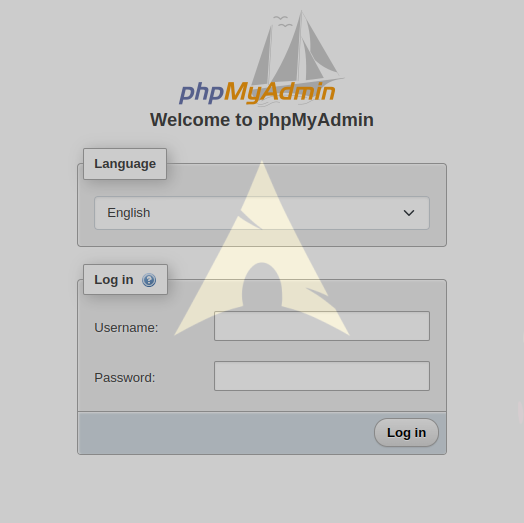
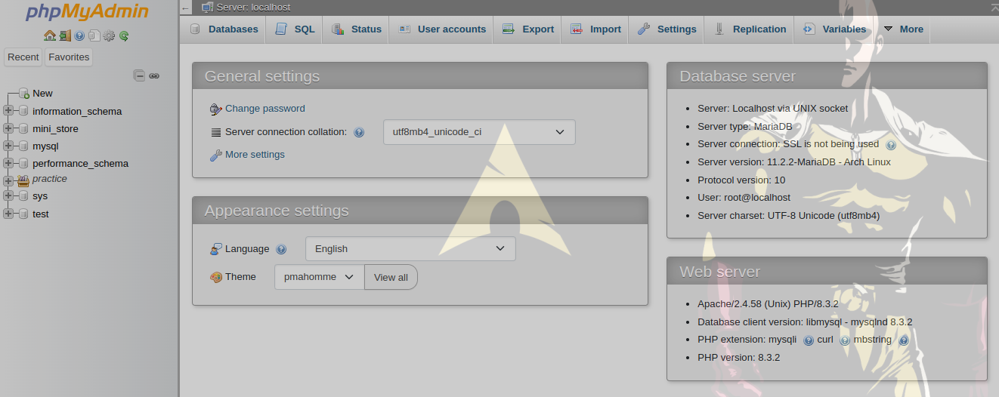

# phpmyadmin_in_ArchLinux :nerd_face:




#### اول از همه میریم mariadb روی سیستم خودمون نصب کنیم و بعد رمز هم براش تعیین میکنیم 
```
sudo pacman -S mariadb
sudo mariadb-install-db --user=mysql --basedir=/usr --datadir=/var/lib/mysql
sudo systemctl enable mariadb --now
systemctl status mariadb
sudo mariadb-secure-installation
```

#### نصب کردن phpmyadmin
```
sudo pacman -S phpmyadmin php-apache
```

####  بعد از اون میریم توی مسیر /etc/php/php.ini و تغییرات زیر رو درش انجام میدیم
```
sudo vim /etc/php/php.ini
```
#### بعد به ترتیب extension=pdo_mysq و extension=mysqli رو از کامنت خارج کنید و بعد از پیدا کردن date.timezone اون رو برابر با Asia/Tehran قرار بدین
```
date.timezone = Asia/Tehran
```

#### بعد display_error برابر با On قرار بدین و open_basedir رو هم به صورت زیر تغییر بدین
```
display_error = On
open_basedir = /srv/http/:/var/www/:/home/:/tmp/:/var/tmp/:/var/cache/:/usr/share/pear/:/usr/share/webapps/:/etc/webapps/
```
> [!CAUTION]
> زمانی که open_basedir رو تعییر میدین به صورت بالا اگر خواستین پروژه جدیدی بسازین و به شما گیر داد و خطا داد مقداری رو که برای اون تعیین کردین بعد از نصب کامل فرایند بردارین و ی بار دیگه تست کنید اگر خطا نداد هنگام پروژه ساختن پس اوکیه میتونین براش مقدار بالا رو تعیین نکنید


#### بعدش فایل رو ذخیره و از اون خارج بشین الان برین به مسیر پایین و فایل رو باز کنید
```
sudo vim /etc/httpd/conf/httpd.conf
```

#### در انتهای فایل خط کد زیر رو قرار بدین 
```
Include conf/extra/php_module.conf
```

> [!CAUTION]
> بعد از این که این خط کد رو در انتهای فایل قرار دادین برای این که از اسم و ورژن اون مطمعن بشین بهتره برین ی بار اسم فایل رو توی مسیر پایین چک کنین
```
cd /etc/httpd/conf/extra
```

#### توی قدم بعدی باید یک فایل به اسم phpmyadmin.conf توی مسیر /etc/httpd/conf/extra/ میسیازیم 
```
sudo touch /etc/httpd/conf/extra/phpmyadmin.conf
```

#### حالا محتویات زیر رو داخل فایل قرار میدیم
```
Alias /phpmyadmin "/usr/share/webapps/phpMyAdmin"
<Directory "/usr/share/webapps/phpMyAdmin">
    DirectoryIndex index.php
    AllowOverride All
    Options FollowSymlinks
    Require all granted
</Directory>
```

#### بعد از انجام این کارا میریم به مسیر /etc/httpd/conf/httpd.conf و این فایل رو دوباره باز میکنیم LoadModule mpm_event_module modules/mod_mpm_event.so رو کامنت میکنیم با گذاشتن یک # پشت اون و بعدش LoadModule mpm_event_module modules/mod_mpm_event.so رو از کامنت خارج کنید با برداشتن # پشت اون
```
#LoadModule mpm_event_module modules/mod_mpm_event.so
LoadModule mpm_event_module modules/mod_mpm_event.so
```

#### بعد از انجام این کار برین و قبل از <IfModule unixd_module> کد پایین رو قرار بدین
```
LoadModule php_module modules/libphp.so
AddHandler php-script .php
<IfModule unixd_module>
```

#### بعد به اخر فایل میریم و محتویات زیر رو قرار میدیم
```
# phpMyAdmin configuration
Include conf/extra/phpmyadmin.conf
```

#### در اخر هم کارهای زیر رو انجام بدین و تمام
```
sudo systemctl enable httpd
sudo systemctl start httpd
sudo systemctl enable mariadb
sudo systemctl start mariadb
```

